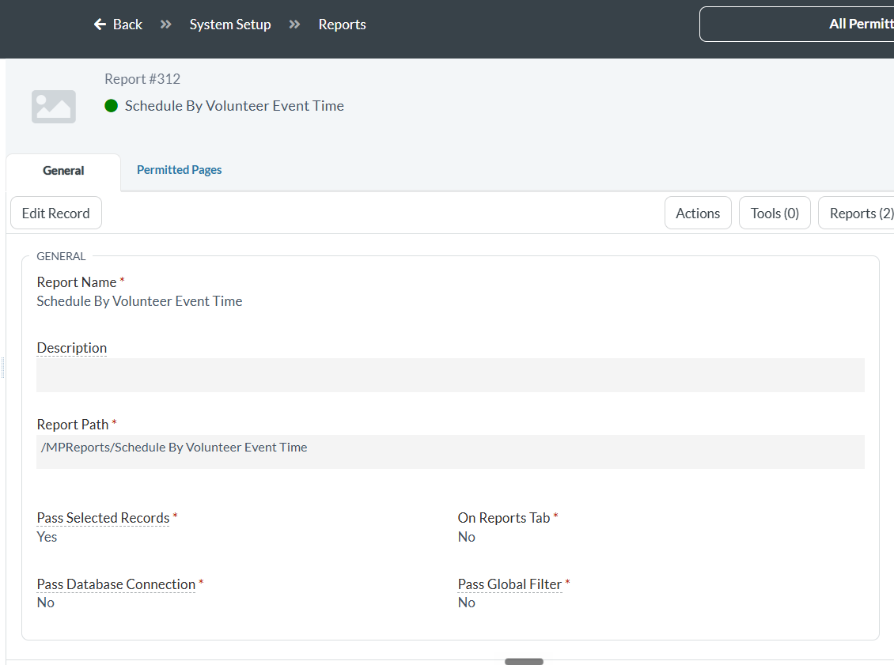
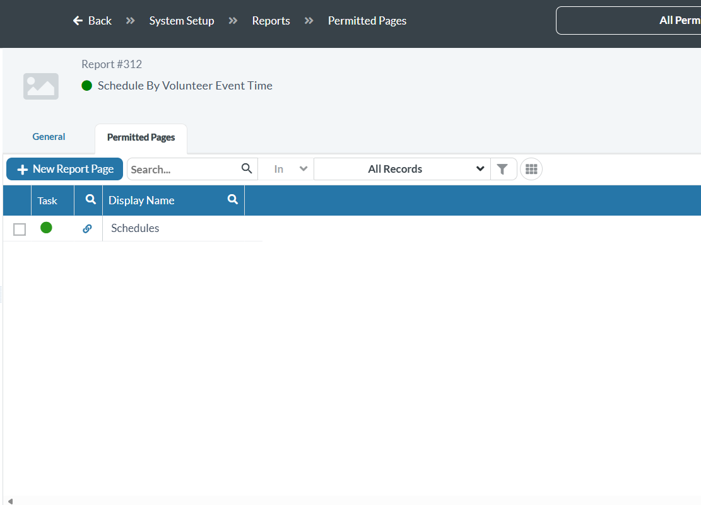
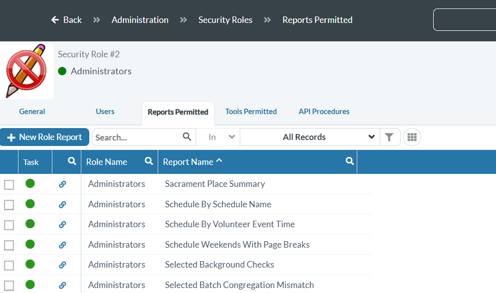

# MPReports — Volunteer Connect Schedule Reports

This contains reports for Volunteer Connect schedules.

The RDL report files are in the `Reports` folder and the stored procedure is in the `Stored Procedures` folder. The 3 volunteer reports all use the same stored procedure.

| File | Type |
|------|------|
| `Reports/Schedule By Schedule Name.rdl` | SSRS report |
| `Reports/Schedule By Volunteer Event Time.rdl` | SSRS report |
| `Reports/Schedule Weekends With Page Breaks.rdl` | SSRS report |
| `Stored Procedures/report_Selected_Schedule_Printout_DIOSF.txt` | Shared stored procedure |

## A few words you'll see a lot

- **SSRS** = SQL Server Reporting Services. It's the "report server" — the program that actually builds and prints the reports. Think of it as the printer that knows how to make the report look nice.
- **RDL file** = the report itself (the `.rdl` files above). It's the design: what columns show up, how it's laid out.
- **Stored procedure** = a saved chunk of database instructions that goes and gets the data the report needs. All 3 reports share one.
- **SSMS** = SQL Server Management Studio. It's the free program you use to talk to the database.
- **MinistryPlatform (MP)** = the church software where staff will click a button to run the report.

So the flow is: **the stored procedure gets the data → the RDL turns it into a report → MinistryPlatform gives staff the button to run it.** We'll set those up in that order.

## Before you start

You need three things. If you don't have them, ask whoever manages your MinistryPlatform server (for dedicated-cloud customers, that's ACS Technologies / Higher Ground support).

1. **SSMS** installed on your computer (free download from Microsoft).
2. **Access to the report server** — the SSRS website, plus the login it asks for. This is a **Windows login for the server**, not your normal MinistryPlatform username. On Dedicated Cloud this usually means a **VPN login** to reach the server network *and* an **RDP login** to sign into the server itself (see "How server access works on Dedicated Cloud" below).
3. **Setup Administrator** rights in MinistryPlatform (so you can add the report records later).

> **Tip:** Practice in a "sandbox" (a test copy) first if you have one, and make a backup before you change anything.

### How server access works on Dedicated Cloud

If you're hosted on Dedicated Cloud with Higher Ground, you can request **VPN**
and **RDP** credentials to your MP servers. You typically use **two logins, in
order**:

1. A **VPN login** — gets you *onto the server network* (nothing more). Higher Ground uses the **WatchGuard VPN Client**.
2. An **RDP login** — signs you into the server's desktop with Remote Desktop. This **same login also signs you in to the SSRS report portal** — the portal uses your Windows login, so there is no separate report-portal password.

How many servers you'll see depends on your tier:

- **Tier 1** runs the web server and the database server on the **same VM** — one server to connect to.
- **Tier 2 and above** run the web server and database server on **separate VMs**. For reports, you connect to the **database server** — that's where SSMS and the SSRS report portal both live (Reporting Services is part of SQL Server). You do **not** use the web server for report work.

> **Worked example — St. Isidore parish (Dedicated Cloud Tier 2).**
> Bob Builder needs to deploy these reports. Higher Ground sends him:
>
> | Item | Value |
> |------|-------|
> | VPN Username | `StIsidore-BBuilder` |
> | VPN Password | `Password-VPN` |
> | Server — **web** | `MP-STISIDORE-W` (`10.215.106.90`) — **Do Not Use** |
> | Server — **database** | `MP-STISIDORE-S` (`10.215.106.91`) — **Connect Here** |
> | RDP Server | `10.215.106.91` |
> | RDP Username | `10.215.106.91\StIsidore-BBuilder` |
> | RDP Password | `Password-RDP` |
>
> Bob (1) connects the **WatchGuard VPN Client** with `StIsidore-BBuilder` / `Password-VPN`, then (2) opens **Remote Desktop** to `MP-STISIDORE-S` (`10.215.106.91`) — the **database** server — signing in as `10.215.106.91\StIsidore-BBuilder` / `Password-RDP`. He ignores `MP-STISIDORE-W`, the web server. On the `-S` server he runs **SSMS** for Part 1 and opens the **SSRS report portal** for Part 2; the report portal takes that same RDP login.
>
> *(The names, IP addresses, and passwords above are made-up placeholders for illustration.)* The `10.215.106.91\StIsidore-BBuilder` form is a **local account on that server** — the part before the `\` is the server's own name (shown here as its IP).

## Part 1 — Add the stored procedure to the database

This teaches the database how to fetch the schedule data.

1. Open **SSMS**.
2. When it asks you to connect, type in your MinistryPlatform **server name** and sign in. (Ask support for the server name if you don't know it.)
3. At the top of the screen there is a drop-down box that lists databases. Pick your **MinistryPlatform** database.
4. Open the file `Stored Procedures/report_Selected_Schedule_Printout_DIOSF.txt` from this project and copy all of the text inside it.
5. In SSMS, click **New Query**, paste the text into the blank window.
6. Click **Execute** (or press the **F5** key). If it says "Commands completed successfully," the stored procedure is now saved in the database. You only do this once — all 3 reports use it.

## Part 2 — Upload the report files to the report server (SSRS)

This puts the actual reports onto the report server so they can run.

1. Open the **SSRS website** in your web browser. The address is usually `https://Reports` or a link support gave you. On Dedicated Cloud, do this **from inside the server** you connected to with Remote Desktop (the database server on Tier 2+).
2. When it asks you to log in, use the **Windows login for the server** (type it as `DOMAIN\username`). On Dedicated Cloud this is your **RDP login** — the same one you used to sign into the server — *not* your MinistryPlatform password. (In the St. Isidore example above, that's `10.215.106.91\StIsidore-BBuilder` / `Password-RDP`.)
3. Make a **new folder** to keep these reports in — for example, name it `MPReports`. (Keeping them in their own folder means MinistryPlatform's regular updates won't overwrite them.)
4. Open your new folder, click **Upload**, and add all three `.rdl` files from the `Reports` folder of this project.
5. Each report needs to know which database to talk to. This connection is called a **data source**. The easy option: use the one that already exists, named **`MPReportsDS`**.
   - To set it: click the **…** (three dots) next to a report → **Manage** → **Data Sources** → choose **`MPReportsDS`** → **Apply**. Do this for all three reports.
6. **Write down the exact path** to each report, starting with a slash — for example `/MPReports/Schedule By Volunteer Event Time`. You'll need it in the next part.

## Part 3 — Turn the reports on in MinistryPlatform

Now the files are on the server. These last three steps make the reports show up for staff inside MinistryPlatform.

### Step 1 — Create the Report record

In **System Setup → Reports**, add a record for each report.

- **Report Name** — what staff see in the report drop-down (e.g. `Schedule By Volunteer Event Time`).
- **Report Path** — the exact path from Part 2, with a leading slash (e.g. `/MPReports/Schedule By Volunteer Event Time`). Spaces are allowed.
- **Pass Selected Records** — set to **Yes**. These reports run against the records the user has selected on the page.
- **On Reports Tab**, **Pass Database Connection**, **Pass Global Filter** — **No**.

### Step 2 — Add the Permitted Page

On the report record, open the **Permitted Pages** tab and add the page the
report launches from. For these schedule reports that is the **Schedules**
page.

### Step 3 — Grant the report to a Security Role

Reports are role-based. In **Administration → Security Roles**, open the
role that should have access (e.g. **Administrators**), go to the
**Reports Permitted** tab, and add each of the three reports.

## Check that it worked

Refresh the **Schedules** page in MinistryPlatform, pick (select) a few
records, and launch the report. If the report opens with your data, every
piece is connected correctly.

If the report just returns you to the starting screen with no error, the
stored procedure probably hit a problem — double-check Part 1. If you get a
"cannot find the report" message, the **Report Path** in Step 1 doesn't match
the real path in SSRS from Part 2 — check the spelling and the leading slash.

